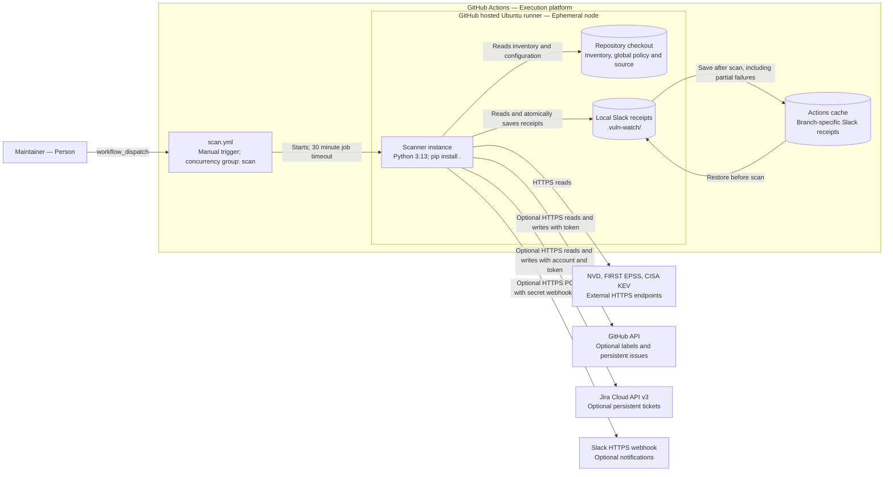

# Deployment

Scope: the manual GitHub Actions scan on an ephemeral hosted runner.

```mermaid
flowchart LR
    user["Maintainer — Person"]
    apis["NVD, FIRST EPSS, CISA KEV<br/>External HTTPS endpoints"]
    issues["GitHub API<br/>Optional labels and persistent issues"]
    jira["Jira Cloud API v3<br/>Optional persistent tickets"]
    slack["Slack HTTPS webhook<br/>Optional notifications"]
    subgraph platform["GitHub Actions — Execution platform"]
        cache[("Actions cache<br/>Branch-specific Slack receipts")]
        workflow["scan.yml<br/>Manual trigger; concurrency group: scan"]
        subgraph runner["GitHub hosted Ubuntu runner — Ephemeral node"]
            checkout[("Repository checkout<br/>Inventory, global policy and source")]
            process["Scanner instance<br/>Python 3.13; pip install ."]
            receipts[("Local Slack receipts<br/>.vuln-watch/")]
            process -->|Reads inventory and configuration| checkout
            process -->|Reads and atomically saves receipts| receipts
        end
        workflow -->|Starts; 30 minute job timeout| process
        cache -->|Restore before scan| receipts
        receipts -->|Save after scan, including partial failures| cache
    end
    user -->|workflow_dispatch| workflow
    process -->|HTTPS reads| apis
    process -->|Optional HTTPS reads and writes with token| issues
    process -->|Optional HTTPS reads and writes with account and token| jira
    process -->|Optional HTTPS POST with secret webhook URL| slack
```

See [the arc42 explanation](../arc42/07-deployment-view.md) and the [view index](README.md).
